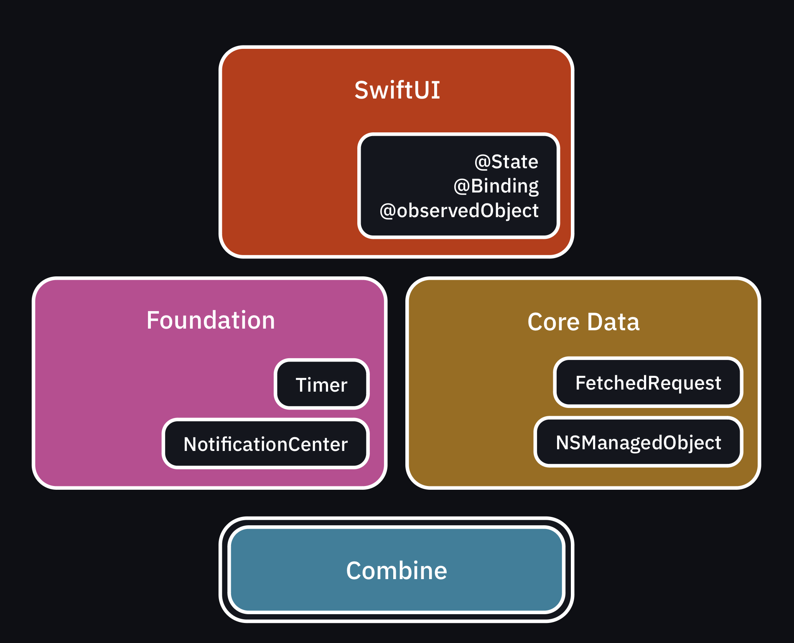

# 1. Hello Combine

[https://developer.apple.com/documentation/Combine](https://developer.apple.com/documentation/Combine)

[https://www.kodeco.com/books/combine-asynchronous-programming-with-swift/v3.0/chapters/1-hello-combine](https://www.kodeco.com/books/combine-asynchronous-programming-with-swift/v3.0/chapters/1-hello-combine)

---

## 0. Combine Framework

The Combine framework provides a declarative Swift API for processing values over time. These values can represent many kinds of asynchronous events. Combine declares *publishers* to expose values that can change over time, and *subscribers* to receive those values from the publishers.

> *The Combine framework provides a declarative Swift API for processing values over time.
These values can represent many kinds of asynchronous events.*
*Combine 프레임워크는 시간에 따라 값을 처리할 수 있는 선언형 Swift API를 제공한다.
이 값들은 많은 종류의 값들을 나타낸다.*
> 

비동기 이벤트(값) 처리 프레임워크라고 생각한다.

장점

- 이벤트 처리 코드를 집중화 할 수 있고, 클로저 중첩이나 규칙기반(convention-based) 콜백 같은 번거로움을 제거하여 가독성을 올리고 유지보수를 더 쉽게 해준다.
- RxSwift랑 비교했을 때 메모리 할당 측면에서 압도적으로 Combine 우세하다.

Apple has integrated Combine into its other frameworks.
→ Timer, NotificationCenter, Core Framework(like Core Data)는 이미 Combine을 사용하고 있음.

## 1. Swift’s Modern Concurrency

Swift 5.5에 async/await가 소개됨. 기존 async 문제들을 쉽게 해결할 수 있음. (ex. 네트워크 응답대기, 여러 작업을 병렬로 실행)

Combine API도 이런 비동기처리에 대한 문제들 중 일부를 해결하지만, **Combine의 강점은 Operator다.**

## 2. Foundation of Combine

Declarative, reactive programming. iOS 13.

## 3. Combine basics

### Publishers

시간 흐름에 따라 Publishers는 하나 이상의 subscribers에게 값을 방출할 수 있는 타입.

publisher는 0개 이상의 value를 emit

3개의 이벤트 타입 emit

1. generic `Output` type
2. A successful `completion`.
3. `Failure` : A completion with an error of the publisher’s `Failure` type

Publisher 프로토콜의 2가지 제네릭 타입

- Publisher.Output - The type of the output values of the publisher.
- Publisher.Failure - The type of error the publisher can throw if it fails. (Publisher가 절대 fail하지 않는 경우 `Never` 로 명시)

### Operators

`Publisher` 프로토콜에 선언되어있는 메서드들. 같거나 새로운 publisher를 return 한다.

operators는 항상 input과 output을 가짐. → **upstream** / **downstream**

### Subscribers

Publisher가 방출한 output 이벤트를 구독해서 이벤트 처리하는 타입.

*공식문서: A protocol that declares a type that can receive input from a publisher.*

Combine에서 제공하는 두가지 빌트인 subscribers

- `sink` : 클로저 이벤트 처리
- `assign` : output의 결과를 특정 data model이나 UIControl의 프로퍼티에 key path를 사용해서 직접적으로 바인딩 할 수 있음.

data에 대한 요구사항이 있는 경우 custom subscriber를 만드는게 custom publisher를 생성하는것보다 쉽다.

## 4. Subscriptions

subscription 프로토콜 : A protocol representing the connection of a subscriber to a publisher.
(이 책에선 **subscription** 이라는 용어는 Combine의 Subscription 프로토콜과 이 프로토콜을 채택한 객체를 모두 지칭함)

- 구독하는 시점이 publisher의 스트림 체인을 활성화 시키는 시점임.
    - 굉장히 중요함 > publisher는 output을 받을 구독자가 없으면 값을 방출하지 않음.
- 구독은 사용자의 custom code와 에러 핸들링을 사용해 비동기 이벤트 체인을 한번만 선언한 후 이에 대해 다시 생각할 필요가 없게 해줌. (결국 한번 선언해놓고 알아서 도니 더 생각하지 않아도된단소리임.) → 비동기 이벤트 체인을 한 번 선언 = **Declarative**

## 5. Cancellable

Combine에서 제공하는 Cancellable 때문에 구독을 메모리로 관리할 필요가 없음.

`sink`, `assign` 두  subscriber모두 `Cancellable` 프로토콜을 채택하고 있다. 메모리로부터 객체를 해제할 때마다 전체 구독은 취소되고 메모리로부터 리소스가 해제된다.

→ 뷰컨트롤러의 프로퍼티에 subscription을 저장해두면 뷰컨이 dismiss 될 때 뷰컨의 프로퍼티도 해제될거고, 구독이 날아가면서 자동으로 subscription에 잡고있던 메모리도 해제됨.(모든 구독 취소)

- 여러 subscription을 넣기 위해서 `Set<AnyCancellable>` 프로퍼티를 만들고 여기에 담으면됨 (RxSwift의 DisposeBag)

## Key Points

- Combine is declarative, reactive framework for processing asynchronous events over time.
- It aims to solve existing problems, like unifying tools for asynchronous programming, dealing with mutable state and making error handling a starting team player.
- Combine revolves around three main types: **publishers** to emit events over time, **operators** to asynchronously process and manipulate upstream events and **subscribers**to consume the results and do something useful with them.
