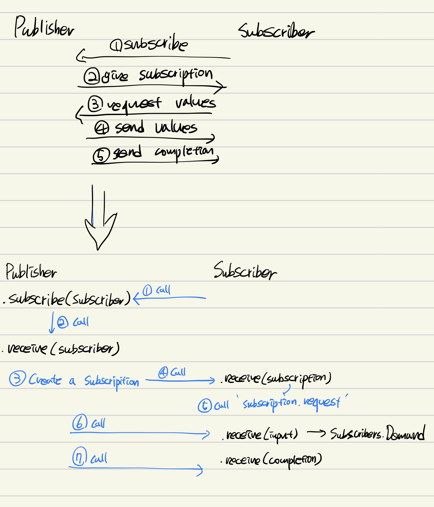
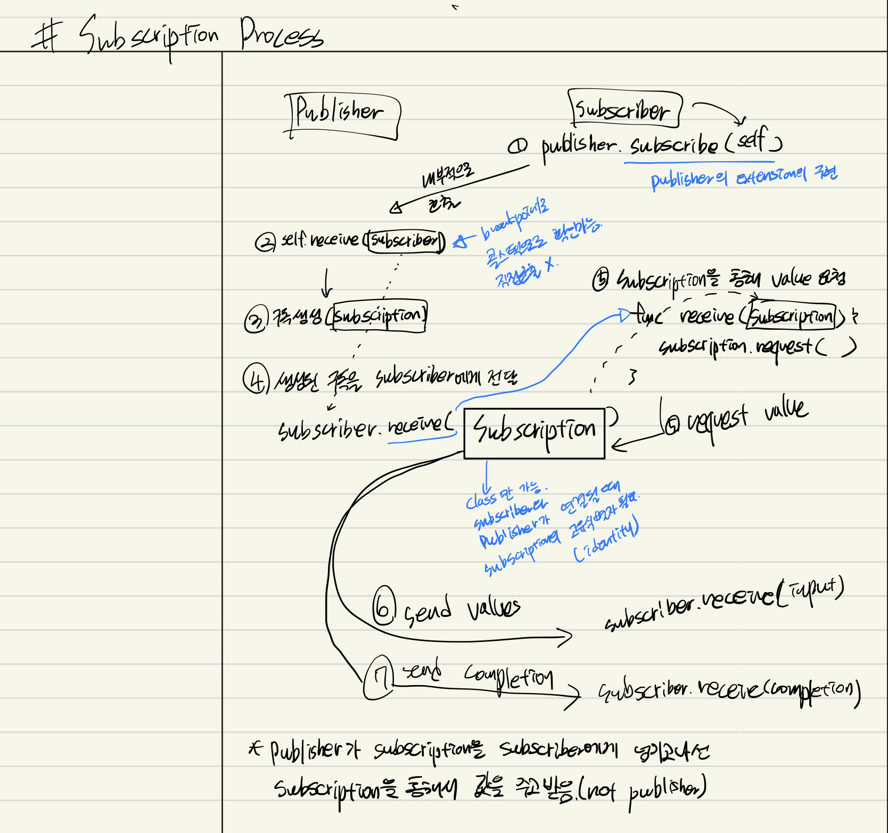

# CombineRemind

Combine 다시 훑고 적용하기. 하루 하나씩 업데이트 예정

[kodeco - Combine 링크](https://www.kodeco.com/books/combine-asynchronous-programming-with-swift)

[이전 책 내용 정리 링크](https://github.com/myssun0325/CombineStudy#combinestudy)

----

#### [1.Hello Combine](1.HelloCombine/1.HelloCombine.md)

#### [2.Publishers & Subscribers](2.PublisherSubscriber/2.PublisherSubscriber.md)

#### [3.Transformning Operators](3.TransformingOperators/3.TransformingOperators.md)

#### [4.Filtering Operators](4.FilteringOperators/4.FilteringOperators.md)

#### [5.Combining Operators](5.CombiningOperators/5.CombiningOperators.md)

#### [6.TimeManipulation Operators](6.TimeManipulationOperators/6.TimeManipulationOperators.md)

#### [7.Sequence Operators](7.SequenceOperators/7.SequenceOperators.md)

#### [8.Share Publisher](8.SharePublisher/8.SharePublisher.md)

#### [9.Networking](9.Networking/9.Networking.md)

#### [10.Debugging](10.Debugging/10.Debugging.md)

#### [11.Timers](11.Timers/11.Timers.md)

#### [12.Key-ValueObserving](12.Key-ValueObserving/12.Key-ValueObserving.md)

#### [13.Resource Management](13.ResourceManagement/13.ResourceManagement.md)

#### [14.In Practice: Project "News"](14.InPracticeProjectNews/14.InPracticeProjectNews.md)

